# session-titles

A [Claude Code](https://claude.com/claude-code) plugin marketplace for mods that keep session titles meaningful.

<p align="center">
  
</p>

## last-prompt-title

Retitles the session every time you send a prompt, so the sidebar tells you what each session is about right now, not what it was about when it started.

- **CLI title**: your prompt collapsed to one line and cut to 60 characters, set at once.
- **Desktop sidebar title**: a short title Haiku writes from your latest prompt, with your previous three prompts as context so a bare follow-up like "explain" still gets a title naming the code or task it is about, set a few seconds later without holding up the turn. If the model gives no answer within 15 seconds, the sidebar gets the cut prompt instead.

Only prompts you type count. Slash commands, empty prompts and machine-injected turns (task notifications, loop wakeups, SDK calls) leave the title alone.

### Install

```
/plugin marketplace add zhangbububu/session-titles
/plugin install last-prompt-title@session-titles
```

Then start a new session (or restart Claude Code) so it loads.

### Good to know

- **Needs a Claude Code build with function hooks** (`classic.UserPromptSubmit`, `$.model`, `$.mcp`). Developed on 2.1.289; older builds won't load it.
- **The sidebar title is desktop-only.** It's set through the desktop app's `ccd_session_mgmt` server. In a terminal session only the CLI title changes.
- **One extra Haiku call per prompt**, billed to your own account the way the session's requests are. It's a small request (`effort: low`, at most 64 output tokens).
- **What the model sees**: the first 1,000 characters of your latest prompt and nothing else. It goes to the same API the session already uses.
- **It overwrites titles you set by hand** on your next prompt.

### Develop

```
claude plugin validate plugins/last-prompt-title
claude plugin test plugins/last-prompt-title
```

## License

[MIT](./LICENSE)
